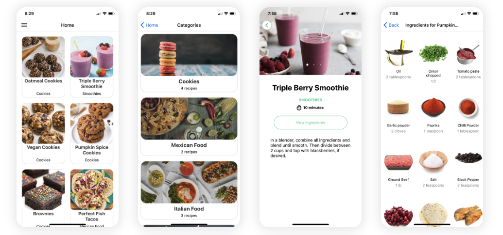

# 🍽️ React Native Recipes App (Frontend UI Demo)

This is a mobile frontend built using **React Native** and **Expo** to showcase a clean, responsive user interface for a recipe browsing application. It is designed to demonstrate skills in building modern mobile UIs using React Native components, navigation, and styling.

---

## 📱 Features

- View recipes with images, ingredients, and instructions
- Browse recipes by categories
- Smooth navigation between screens
- Clean and modern design
- Optimized for Android and iOS

---

## 🛠️ Tech Stack

- React Native
- Expo
- React Navigation
- JavaScript / JSX
- Custom Styling

---

## 📸 Screenshots

| Home Page |
|-----------|---------------|----------------|
|  |

---

## 🚀 Getting Started

### 1. Clone the Repo
```bash
git clone https://github.com/Kamleshseervi/react-native-ui-demo.git
cd react-native-ui-demo
